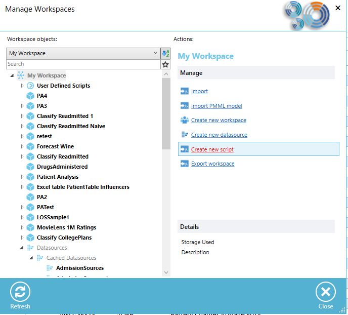
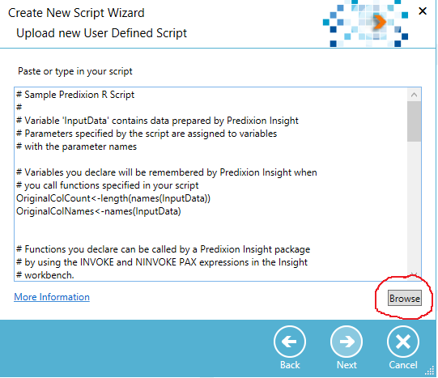
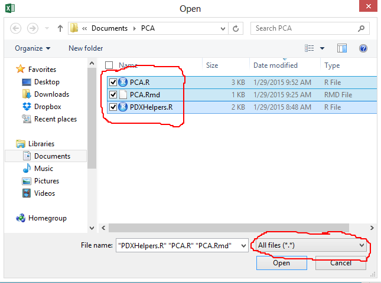
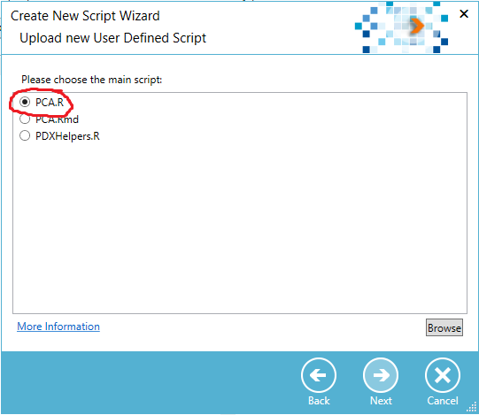
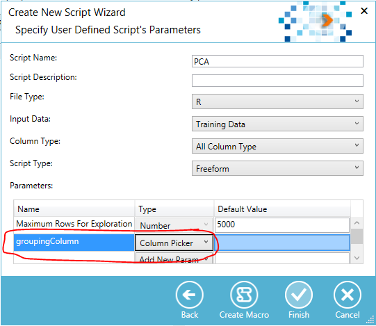

# pca-r-script

Principal Component Analysis in R compatible with [Predixion Insight][1]

## Overview
This script enhances [Predixion Insight][1] by adding Principle Component Analysis to the platform.  By using this script you can perform the PCA analysis, explore and collaborate on the results, and add the resulting components to your Machine Learning Semantic Model (MLSM) packages for use as query results or as inputs to other predictive models.

The following R integration points are exemplified in this script:

- Accessing [Predixion Insight][1] data from R 
- Creating scripts with multiple files
- Creating HTML reports with knitR and ggplot
- Saving R content for reuse later
- Declaring an R function to be called from PAX
- Using a column-picker parameter

[1]: http://cloud.predixionsoftware.com

## Deploying the Script
The R script needs to be uploaded to the workspace of any MLSM package that will reference the script.  Uploading a script to the Predixion Insight server requires the use of the Predixion Insight Excel client which is accessible for download from your local Predixion Insight server or from the [Predixion Insight free trial][2].

To upload a script to a workspace, click on the **Workspaces** button on the **Insight Analytics** ribbon.  Choose the workspace to which you want to upload a script and select the *Create New Script* link.

On the *Upload User Defined Script* page of the *Create New Script* Wizard click on the *Browse* button.

In the *File Open* dialog, browse to the location of the R script in your file system, make sure that you have *All files* selected in the file type selector, and select all three files that encompass this R script.  Click OK to dismiss the dialog.

On the *Upload User Defined Script* page, click the *PCA.R* file to indicate is as the main file of the R script, then click next.

On the *Specify Parameters* page, enter a name for the script (e.g. "PCA"), and ensure that **Input Data** is set to *Training Data*, **Column Type** is set to *All Column Type* and **Script Type** is set to *Freeform*.

Most importantly, as this script contains a parameter that the user needs to specify, add a parameter *groupingColumn* by typing in the next empty cell under **Name** and give it the type *Column Picker*.  Click Finish to upload the script to the Predixion Insight server.

[2]: https://www.predixionsoftware.com/free-trial

